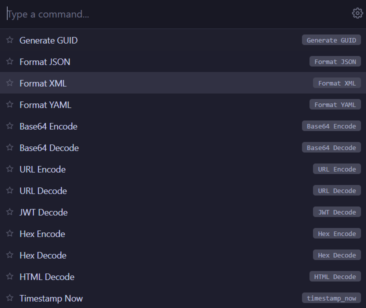

# Magic Hotkey

A fast, keyboard-driven command palette that lives behind a global hotkey. Generate UUIDs, encode/decode Base64, retrieve secrets from your OS keychain, chain actions into pipelines, and more — all without leaving what you're doing.

Built with [Tauri v2](https://tauri.app/) (Rust + HTML/CSS/JS). Runs on Windows and macOS.

## What It Does

Press **Ctrl+Shift+H** (customizable) and a small floating palette appears:



- Type to filter, arrow keys to navigate, **Enter** to execute
- Result is copied to your clipboard instantly
- Palette auto-hides when you click away or press **Escape**
- **Smart suggestions** — detects what's on your clipboard (JSON, JWT, Base64, timestamps, etc.) and highlights relevant commands
- **Pin favorites** — star commands to keep them at the top

## Pipelines

Commands are **pipelines** — one or more actions chained together. Each step's output feeds into the next step's input.

```
secret:api_token  →  base64_encode  →  uppercase
     ↓                    ↓                ↓
  "sk-abc123"      "c2stYWJjMTIz"   "C2STYWJJMTIZ"
```

Single-step pipelines work like simple commands. Multi-step pipelines unlock powerful combinations:

| Example pipeline | What it does |
|---|---|
| `generate_guid` | Generates a UUID and copies it |
| `format_json` | Pretty-prints JSON from your clipboard |
| `secret:api_token` → `base64_encode` | Fetches a secret, then Base64-encodes it |
| `jwt_decode` → `format_json` | Decodes a JWT, then pretty-prints the result |
| `secret:config` → `base64_decode` → `format_json` | Decodes a Base64-encoded JSON config from keychain |
| `snippet` → `uppercase` | Fill a template, then uppercase the result |
| `count` | Shows character, word, line, byte counts with per-value copy buttons |

### Available Actions

**Generators** (produce output, used as first step):

| Action | Description |
|--------|-------------|
| `generate_guid` | Random UUID v4 |
| `timestamp_iso` | Current time as ISO 8601 (e.g. `2026-03-26T14:30:00+01:00`) |
| `timestamp_unix` | Current time as Unix epoch (e.g. `1774540200`) |
| `timestamp_utc` | Current time as UTC (e.g. `2026-03-26T13:30:00Z`) |
| `secret` | Retrieve a named secret from OS keychain |
| `snippet` | Text template with `{{variable}}` placeholders — prompts for each value |
| `lorem_ipsum` | Generate placeholder text (key: `"50 words"`, `"3 sentences"`, `"2 paragraphs"`) |
| `roll` | Roll dice — NdM±K notation (key: `1d20`, `3d6+2`, `4d6-1`). Leave key blank to prompt at runtime. |

**Transformers** (transform input, can be chained):

| Action | Description |
|--------|-------------|
| `format_json` | Pretty-print JSON |
| `format_xml` | Pretty-print XML |
| `format_yaml` | Pretty-print YAML |
| `base64_encode` | Encode to Base64 |
| `base64_decode` | Decode from Base64 |
| `url_encode` | URL-encode text |
| `url_decode` | URL-decode text |
| `jwt_decode` | Decode JWT header + payload |
| `hex_encode` | String to hex bytes |
| `hex_decode` | Hex bytes to string |
| `html_decode` | Decode HTML entities |
| `md_to_html` | Markdown to HTML |
| `html_to_md` | HTML to Markdown (best-effort) |
| `hash_md5` | MD5 hash |
| `hash_sha1` | SHA1 hash |
| `hash_sha256` | SHA256 hash |
| `number_convert` | Decimal ↔ binary ↔ octal ↔ hex (auto-detects `0x`, `0b`, `0o` prefixes) |
| `color_convert` | HEX ↔ RGB ↔ HSL (auto-detects `#RRGGBB`, `rgb(...)`, `hsl(...)`) |
| `json_to_yaml` | JSON to YAML |
| `json_to_toml` | JSON to TOML |
| `yaml_to_json` | YAML to JSON |
| `toml_to_json` | TOML to JSON |
| `unix_to_date` | Unix timestamp to human-readable date |
| `date_to_unix` | Date string to Unix epoch |
| `uppercase` | Convert to UPPERCASE |
| `lowercase` | Convert to lowercase |
| `trim` | Trim whitespace |
| `regex_extract` | Extract regex matches from text (key: regex pattern, supports capture groups) |
| `count` | Character, word, line, byte count (shown in overlay with copy buttons) |

When a transformer is the first step, it reads from your clipboard.

### Security

- Secrets are stored in the **OS keychain**, never in config files
- Sensitive values are only passed through the clipboard, not logged or persisted
- No telemetry, no network calls

## Install

### Download

Grab the latest release from the [Releases](../../releases) page:

- **Windows:** `Magic Hotkey_x.x.x_x64_en-US.msi`
- **macOS:** `Magic Hotkey_x.x.x_aarch64.dmg` or `.app`

### Build From Source

See [Contributing](#contributing) below.

## Usage

### Creating Pipelines

1. Open the palette (**Ctrl+Shift+H**)
2. Click the **gear icon** to open Settings
3. Under **Commands**, click **+ New Pipeline**
4. Name it, add steps, chain actions together
5. Click **Save**

The first step dropdown shows all actions. Subsequent steps only show transformers (since they receive piped input). Use `×` to remove a step.

Commands are stored in your config directory:
- **Windows:** `%APPDATA%\magic-hotkey\commands.json`
- **macOS:** `~/Library/Application Support/magic-hotkey/commands.json`

### Snippets (Templates)

Create reusable text templates with `{{variable}}` placeholders:

1. Create a new pipeline, pick **Snippet (template)** as the action
2. Type your template: `SELECT {{columns}} FROM {{table}} WHERE {{condition}}`
3. Save it

When you run the snippet from the palette:
- It prompts for each variable one at a time, with a live preview
- **Enter** / **Tab** advances to the next variable
- **Shift+Enter** goes back to the previous one
- **Escape** cancels
- After the last variable, the filled text is copied to your clipboard

Snippets are pipeline steps, so you can chain them: `snippet → uppercase` or `snippet → base64_encode`.

### Storing Secrets

1. Open Settings (gear icon)
2. Under **Secrets**, click **+ Add**
3. Enter a name (e.g. `api_token`) and the secret value
4. Click **Save to Keychain**

This stores the value in your OS keychain and automatically creates a single-step command for it. You can then edit that command to add more steps (e.g. `secret:api_token` → `base64_encode`).

### Auto-Paste

When enabled, Magic Hotkey automatically simulates **Ctrl+V** (or **Cmd+V** on macOS) after copying a result to clipboard — so the output gets pasted directly into whatever app you were using.

1. Open Settings
2. Toggle **Auto-paste after copy** on
3. Click **Save Settings**

The paste happens after a short delay to let the palette window hide and focus return to your previous app.

> **macOS note:** The app needs Accessibility permission in System Settings > Privacy & Security > Accessibility.

### Launch on Startup

1. Open Settings
2. Toggle **Launch on startup** on
3. Click **Save Settings**

This registers the app with your OS login system:
- **Windows:** Registry (`HKCU\Software\Microsoft\Windows\CurrentVersion\Run`)
- **macOS:** Launch Agent (`~/Library/LaunchAgents/`)

### Changing the Hotkey

1. Open Settings
2. Click **Record** next to the hotkey field
3. Press your desired key combination (e.g. `Ctrl+Alt+Space`)
4. Click **Save Settings**

Settings are stored at:
- **Windows:** `%APPDATA%\magic-hotkey\settings.json`
- **macOS:** `~/Library/Application Support/magic-hotkey/settings.json`

### Per-Command Keyboard Shortcuts

Assign a dedicated hotkey to any pipeline so it runs instantly without opening the palette:

1. Edit a pipeline in Settings
2. Under **Shortcut**, click **Record** and press your key combo (e.g. `Ctrl+Shift+G`)
3. Save the pipeline

Now pressing that hotkey anywhere runs the pipeline directly — the result is copied to clipboard and a brief toast confirms it. Snippets and display commands (like Count) show their full UI.

### Workflow Triggers

Auto-run a pipeline when your clipboard matches a pattern:

1. Edit a pipeline in Settings
2. Under **Auto-trigger**, enter a regex pattern
3. Save the pipeline

Now whenever you copy text that matches, the pipeline runs automatically in the background. An OS notification confirms it fired.

| Example pattern | What it matches |
|---|---|
| `^eyJ` | JWTs (base64-encoded JSON) |
| `^\d{10,13}$` | Unix timestamps |
| `^\{` | JSON objects |
| `^https?://` | URLs |

## CLI (`mh`)

All Magic Hotkey transformations are available as a command-line tool called `mh`. It reads from stdin and writes to stdout — fully pipeable.

```bash
# Generate
mh gen guid
mh gen timestamp-iso

# Encode / Decode
echo "hello" | mh encode base64
echo "aGVsbG8=" | mh decode base64
echo "token.payload.sig" | mh decode jwt

# Format
echo '{"a":1}' | mh fmt json
cat messy.xml | mh fmt xml

# Hash
echo -n "password" | mh hash sha256

# Convert
cat config.yaml | mh convert yaml json
echo '{"a":1}' | mh convert json toml

# Color & Number
mh color "#ff5500"
mh number 0xff

# Dice
mh roll 1d20
mh roll 3d6+2

# Chain actions
echo "hello" | mh pipe base64_encode uppercase trim

# Run a saved pipeline
mh run "My Custom Pipeline" < input.txt

# Manage secrets
echo "sk-abc123" | mh secret set api_token
mh secret get api_token

# List all pipelines
mh list
```

Build the CLI with `cargo build --bin mh` from the `src-tauri/` directory.

---

## Contributing

### Prerequisites

| Tool | Version | Notes |
|------|---------|-------|
| [Node.js](https://nodejs.org/) | 18+ | For the Tauri CLI and frontend tooling |
| [Rust](https://rustup.rs/) | 1.77+ | `curl --proto '=https' --tlsv1.2 -sSf https://sh.rustup.rs \| sh` |

#### Windows only

- **LLVM-MinGW** — install via `winget install MartinStorsjo.LLVM-MinGW.UCRT`
- **Rust toolchain:** `rustup default stable-x86_64-pc-windows-gnullvm`
- Make sure the LLVM-MinGW `bin/` directory is on your `PATH`

#### macOS only

- **Xcode Command Line Tools:** `xcode-select --install`

### Setup

```bash
git clone https://github.com/towmeykaw/magic-hotkey.git
cd magic-hotkey
npm install
```

### Development

```bash
npx tauri dev
```

This launches the app in dev mode with hot-reload for the frontend. Rust changes trigger a recompile automatically.

### Build

```bash
npx tauri build
```

Produces platform-specific installers in `src-tauri/target/release/bundle/`.

### Project Structure

```
magic-hotkey/
├── src/                          # Frontend (HTML/CSS/JS)
│   ├── index.html                # UI layout — palette, settings, pipeline editor
│   ├── main.js                   # Frontend logic, pipeline builder, Tauri IPC
│   └── styles.css                # Dark theme (Catppuccin Mocha)
├── src-tauri/                    # Rust backend
│   ├── src/
│   │   ├── lib.rs                # App setup, pipeline execution, hotkey, IPC
│   │   ├── commands.rs           # All action implementations
│   │   ├── main.rs               # Entry point
│   │   └── bin/mh.rs             # CLI tool
│   ├── capabilities/
│   │   └── default.json          # Tauri permissions
│   ├── Cargo.toml                # Rust dependencies
│   └── tauri.conf.json           # Window config, app identity, bundling
└── package.json
```

### Adding a New Action

1. **Rust:** Add your function to `src-tauri/src/commands.rs`
2. **Rust:** Add a match arm in `run_action()` in `src-tauri/src/lib.rs`
3. **Frontend:** Add an entry to the `ACTIONS` array in `src/main.js` (set `type` to `"generator"` or `"transformer"`)
4. That's it — the pipeline builder, palette, and persistence all pick it up automatically

### Tech Stack

- **[Tauri v2](https://tauri.app/)** — Lightweight native app framework (Rust backend, webview frontend)
- **[keyring](https://crates.io/crates/keyring)** — Cross-platform OS keychain access (Windows Credential Manager / macOS Keychain)
- **[uuid](https://crates.io/crates/uuid)** — UUID v4 generation
- **[base64](https://crates.io/crates/base64)** — Base64 encoding/decoding
- **[urlencoding](https://crates.io/crates/urlencoding)** — URL encoding/decoding
- **Vanilla HTML/CSS/JS** — No framework, no build step for the frontend

## License

MIT
